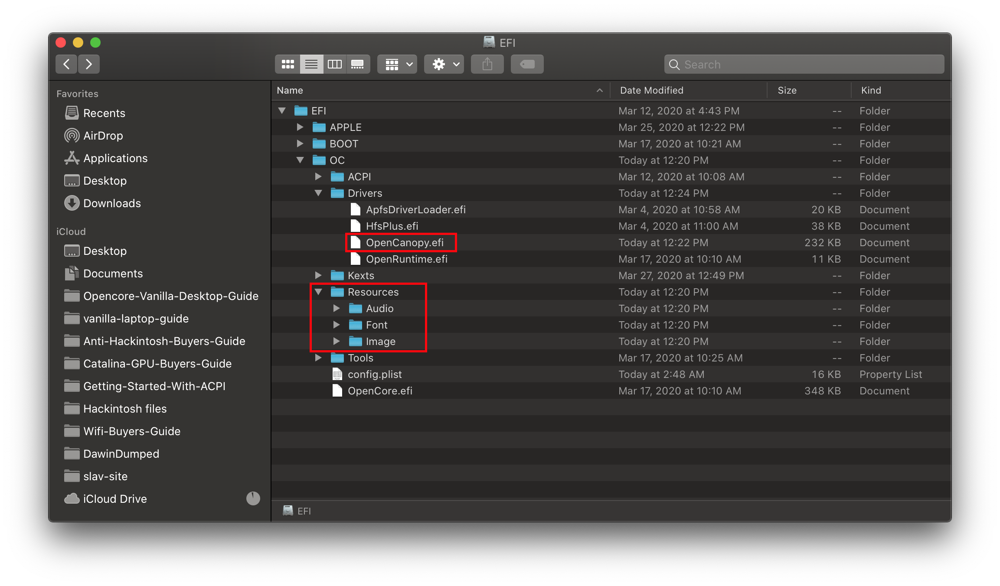
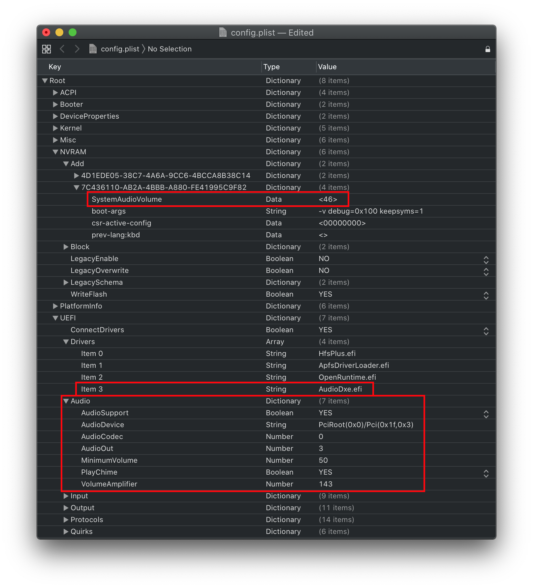

# OpenCore beauty treatment


Main thing this guide will go over:

* [Setting up OpenCore's GUI](#setting-up-opencores-gui)
* [Setting up a boot-chime](#setting-up-boot-chime-with-audiodxe)

## Setting up OpenCore's GUI

So to get started, we're gonna need 0.5.7 or newer as these builds have the GUI included with the rest of the files. If you're on an older version, I recommend updating: [Updating OpenCore](../universal/update.md)

Once that's done, we'll need a couple things:

* [Binary Resources](https://github.com/acidanthera/OcBinaryData)
* [OpenCanopy.efi](https://github.com/acidanthera/OpenCorePkg/releases)
  * Note: OpenCanopy.efi must be from the same build as your OpenCore files, as mismatched files can cause boot issues

Once you have both of these, we'll next want to add it to our EFI partition:

* Add the [Resources folder](https://github.com/acidanthera/OcBinaryData) to EFI/OC
* Add OpenCanopy.efi to EFI/OC/Drivers



Now in our config.plist, we have 2 things we need to fix:

* `Misc -> Boot -> PickerMode`: `External`
* `Misc -> Boot -> PickerAttributes`:`1`
  * This enables .VolumeIcon.icns reading off the drive, this is how macOS installer icons work
    * 0x0008: This is another value which allows for alternative icons, such as the legacy GUI found on legacy Macs. This can be combined with `1` for both legacy GUI and custom drive icons(PickerAttributes: `9`)
    * Other settings for PickerAttributes can be found in the [Configuration.pdf](https://github.com/acidanthera/OpenCorePkg/blob/master/Docs/Configuration.pdf)
* `UEFI -> Drivers` and add OpenCanopy.efi

Once all this is saved, you can reboot and be greeted with a true Mac-like GUI:


## Setting up Boot-chime with AudioDxe

So to start, we'll need a couple things:

* Onboard audio output
  * USB DACs will not work
  * GPU audio out is a hit or miss
* [AudioDxe](https://github.com/acidanthera/OpenCorePkg/releases) in both EFI/OC/Drivers and UEFI -> Drivers
* [Binary Resources](https://github.com/acidanthera/OcBinaryData)
  * Add the Resources folder to EFI/OC, just like we did with the OpenCore GUI section
  * For those running out of space, `OCEFIAudio_VoiceOver_Boot.wav` is all that's required for the Boot-Chime
* Debug version of OpenCore with logging enabled
  * See [OpenCore Debugging](https://dortania.github.io/OpenCore-Install-Guide/troubleshooting/debug.html) for more info

**Settings up NVRAM**:

* NVRAM -> Add -> 7C436110-AB2A-4BBB-A880-FE41995C9F82:
  * `SystemAudioVolume | Data | 0x46`
  * This is the boot-chime and screen reader volume, note it's in hexadecimal so would become `70` in decimal

**Setting up UEFI -> Audio:**

* **AudioCodec:**
  * Codec address of Audio controller
  * To find yours:
    * Check [IORegistryExplorer](https://github.com/khronokernel/IORegistryClone/blob/master/ioreg-302.zip) -> HDEF -> AppleHDAController -> IOHDACodecDevice and see the `IOHDACodecAddress` property
    * ex: `0x0`
      * Can also check via terminal(Note if multiple show up, use the vendor ID to find the right device)l:

 ```sh
 ioreg -rxn IOHDACodecDevice | grep VendorID   // List all possible devices
 ```

 ```sh
 ioreg -rxn IOHDACodecDevice | grep IOHDACodecAddress // Grab the codec address
 ```

* **Audio Device:**
  * PciRoot of audio controller
  * Run [gfxutil](https://github.com/acidanthera/gfxutil/releases) to find the path:
    * `/path/to/gfxutil -f HDEF`
    * ex: `PciRoot(0x0)/Pci(0x1f,0x3)`

* **AudioOut:**
  * The specific output of your Audio controller, easiest way to find the right one is to go through each one(from 0 to N - 1, where N is the number of outputs listed in your log)
  * ex: 5 outputs would translate to 0-4 as possible values
    * You can find all the ones for your codec in the OpenCore debug logs:

```
06:065 00:004 OCAU: Matching PciRoot(0x0)/Pci(0x1F,0x3)/VenMsg(A9003FEB-D806-41DB-A491-5405FEEF46C3,00000000)...
06:070 00:005 OCAU: 1/2 PciRoot(0x0)/Pci(0x1F,0x3)/VenMsg(A9003FEB-D806-41DB-A491-5405FEEF46C3,00000000) (5 outputs) - Success
```

* **AudioSupport:**
  * Set this to `True`

* **MinimumVolume:**
  * Volume level from `0` to `100`
  * To not blow the speakers, set it to `70`
  * Note boot-chime will not play if MinimumVolume is higher than `SystemAudioVolume` that we set back in the `NVRAM` section

* **PlayChime:**
  * Set this to `True`

* **VolumeAmplifier:**
  * The Volume amplification, value will differ depending on your codec
  * Formula is as follows:
    * (SystemAudioVolume * VolumeAmplifier)/100 = Raw Volume(but cannot exceed 100)
    * ex: (`70` x `VolumeAmplifier`)/`100` = `100`  -> (`100` x `100`) / `70` = VolumeAmplifier = `142.9`(we'll round it to `143` for simplicity)

Once done, you should get something like this:



**Note for visually impaired**:

* OpenCore hasn't forgotten about you! With the AudioDxe setup, you can enable both picker audio and FileVault VoiceOver with these 2 settings:
  * `Misc -> Boot -> PickerAudioAssist -> True` to enable picker audio
  * `UEFI -> ProtocolOverrides -> AppleAudio -> True` to enable FileVault voice over
    * See [Security and FileVault](../universal/security.md) on how to setup the rest for proper FileVault support
