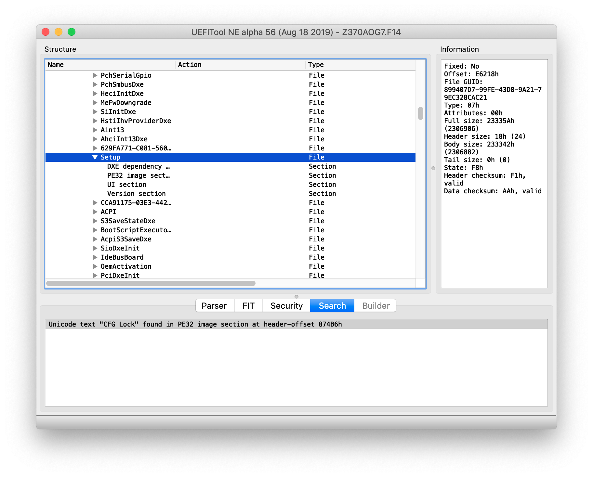
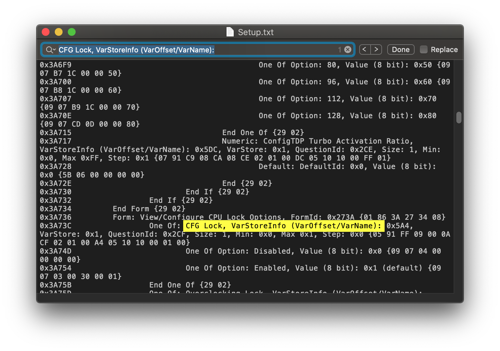

# Fixing CFG Lock

* Supported version: 0.5.9

<extoc></extoc>

Do note that this is only recommended for users who have already installed macOS, for users who are installing for the first time enable `AppleCpuPmCfgLock` and `AppleXcpmCfgLock` under `Kernel -> Quirks`

## What is CFG-Lock

CFG-Lock is a setting in your BIOS that allows for a specific register(in this case the MSR 0xE2) to be written to. By default, most motherboards lock this variable with many even hiding the option outright in the GUI. And why we care about it is that macOS actually wants to write to this variable, and not just one part of macOS. Instead both the Kernel(XNU) and AppleIntelPowerManagement want this register.

So to fix it we have 2 options:

1. Patch macOS to work with our hardware

* This creates instability and unnecessary patching for many
* The 2 patches we use for this:
  * `AppleCpuPmCfgLock` for AppleIntelPowerManagement.kext
  * `AppleXcpmCfgLock` for the Kernel(XNU)

2. Patch our firmware to support MSR E2 write

* Very much preferred, as avoids patching allowing for greater flexibility regarding stability and OS upgrades
  
Note: Penyrn based machines actually don't need to worry about unlocking this register

## Disabling CFG Lock

So you've installed macOS but you're using those pesky `CFG-Lock` patches that we want to get rid of, well to do this is fairly simple. You'll need the following:

Inside your EFI/OC/Tools folder and config.plist:

* [VerifyMsrE2](https://github.com/acidanthera/OpenCorePkg/releases)
* [Modified GRUB Shell](https://github.com/datasone/grub-mod-setup_var/releases)

And some apps to help us out:

* [UEFITool](https://github.com/LongSoft/UEFITool/releases) (Make sure it's UEFITool and not UEFIExtrac)
* [Universal-IFR-Extractor](https://github.com/LongSoft/Universal-IFR-Extractor/releases)

And don't forget to disable the following from your config.plist under `Kernel -> Quirks`:

* `AppleCpuPmCfgLock`
* `AppleXcpmCfgLock`

And the final part, grabbing your BIOS from the vendors' website.

Now the fun part!

## Checking if CFG-Lock can be turned off

Boot OpenCore and select the `VerifyMsrE2` option in the picker. This tool will tell you whether your BIOS supports CFG-Lock and if it can be unlocked.

## Turning off CFG-Lock manually

1. Open your firmware with UEFITool and then find `CFG Lock` as a Unicode string. If nothing pops up then your firmware doesn't support `CFG Lock`, otherwise continue on.



1. You'll find that this string is found within a Setup folder, right-click and export as `Setup.bin`
2. Open your setup file with `ifrextract` and export as a .txt file with terminal:

   ```
   path/to/ifrextract path/to/Setup.bin path/to/Setup.txt
   ```

3. Open the text file and search for `CFG Lock, VarStoreInfo (VarOffset/VarName):` and note the offset right after it(ie: `0x5A4`)



1. Run the Modified GRUB Shell and paste the following where `0x5A4` is replaced with your value:

   ```
   setup_var 0x5A4 0x00
   ```

   Do note that variable offsets are unique not just to each motherboard but even to its firmware version. **Never try to use an offset without checking.**

And you're done! Now you'll have correct CPU power management

* **Note**: Every time you reset your BIOS you will need to flip this bit again, make sure to write it down with the BIOS version so you know which.

* **Note 2**: Some OEMs like Lenovo may have the variable set but cannot unlock it without physically modding the BIOS, for these situations you may need to use a tool like [RU](http://ruexe.blogspot.com/): [CFG LOCK/Unlocking - Alternative method](https://www.reddit.com/r/hackintosh/comments/hz2rtm/cfg_lockunlocking_alternative_method/)