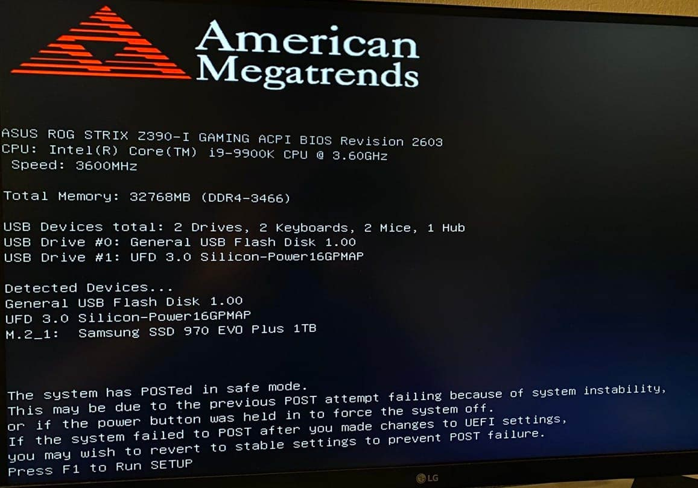
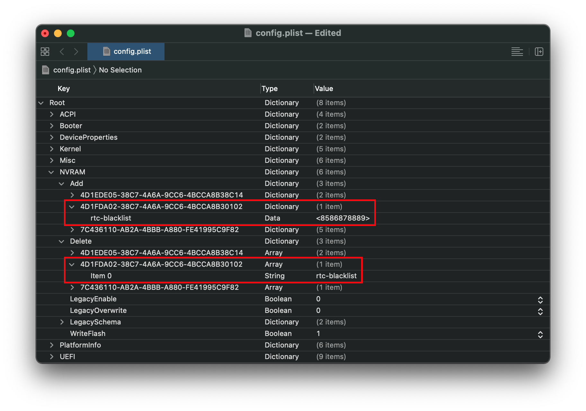

# Fixing RTC write issues

What this section attempts to teach is how to resolve RTC(CMOS) issues on reboot/wake with certain machines. Most commonly looking like the image below:

The reason that these CMOS and safe mode errors happen is due to AppleRTC writing to certain areas that are not supported by the hardware properly and thus resulting in panics and errors. 

To get around this, we've commonly blocked out all RTC writes with [these types of patches](https://github.com/RehabMan/HP-ProBook-4x30s-DSDT-Patch/blob/master/config_parts/config_master.plist#L291L296) but they're not ideal for many reasons including both breaking Windows and linux and disabling potential supported regions like for power management. 

So with OpenCore, we've got a few options to choose:

* Patch AppleRTC from writing to specific regions
  * They may break in future OS updates
  * Much more difficult for the end user to patch
  * Does not handle EfiBoot writing to RTC
* Omit bad regions from being writable
  * They may break in future firmware updates
  * Much easier for the end user to patch
  * Prevents EfiBoot from breaking your system as well

The former is actually already integrated into OpenCore with the `DisableRtcChecksum` quirk, but has the downfall of only blocking regions 0x58-0x59 and only working in the kernel level. Best way to know if this option is best, enable it and try. If this doesn't work, disable as it's an unnecessary patch.

With the latter, we're able to block very specific regions of our choice that match our exact model. And we're able to do this both in the kernel level and firmware aiding with hibernation support. This however will requires much more time and [RTCMemoryFixup](https://github.com/acidanthera/RTCMemoryFixup/releases/tag/1.0.6).

## Finding our bad RTC region

For the rest of this guide, we're going to assume you've tested option 1(`DisableRtcChecksum`) and it didn't work or you're having issues with EfiBoot also writing to RTC. To get started, we should first introduce a few ideas:

* RTC will have regions spanning from 0 to 255
* These regions will be in the hexadecimal counting system so in reality will be 0x00-0xFF
* To omit bad regions, we use the boot-arg `rtcfx_exclude=00-FF`
  * Replace `00-FF` with your bad region (or regions)
  * Reminder that `boot-args` is located under `NVRAM -> Add -> 7C436110-AB2A-4BBB-A880-FE41995C9F82` in your config.plist
  * This will also require you to have [RTCMemoryFixup](https://github.com/acidanthera/RTCMemoryFixup/releases/tag/1.0.6) in your config.plist and EFI/OC/Kexts folder.
* There can be multiple bad regions
* To find the bad region, we'll want to split out search into chunks

Regarding splitting out chunks, what we'll be doing is omitting chunks of RTC regions until we've narrowed down far enough to the exact spot that's bad. You can see the below on how to start:

1. Testing RtcMemoryFixup
  * To start, you'll need to add `rtcfx_exclude=00-FF` in boot-args. If after a reboot the RTC errors seems solved, this will tell you whether your CMOS errors are RTC related
2. Split 0x00-0xFF into 2
  * 0x00-0x7F and 0x80-0xFF
      * write down the excluded range which fixes the RTC errors and proceed by splitting more into chunks
      * e.g. `rtcfx_exclude=00-7F`fixes the RTC errors so you're gonna split it by half and don't consider more `rtcfx_exclude=80-FF`
  * Test `rtcfx_exclude=00-7F` and `rtcfx_exclude=80-FF`
    * Note you may also get a bad range of 7F-80, or even bad regions split into multiple sections(ex. 0x00-0x01 **and** 0x80-0x81)
	* You can use `rtcfx_exclude=00-01,7F-80` to resolve this
3. After testing which regions is bad, shrink even more
  * Assuming our bad region was within 0x80-0xFF, you'd next split that into 2:
  * 0x80-0xBF and 0xC0-0xFF
    * if you had multiple ranges that are bad
4. And you'll continue on with this pattern until you've narrowed down the bad region. Note that you will need to reboot each time to test if you're still getting CMOS/Safe-mode errors
  * Also note that the final bad spot will usually be a range and not a singular spot.
  * ie. `rtcfx_exclude=85-86` instead of one singular value

  
**Pro tip**: To find a value in between 2 regions, I recommend first converting from hexadecimal to decimal, then run the below equation:

* `(x + y) / 2` 

Now lets try to use this with step 1 from earlier:

* 0x00-0xFF -> 0-255 -> `(0 + 255) / 2` = 127.5

Now with 127.5, you'll round up and down to get yourselves an end and a start value:

* 0-127 -> 0x00-0x7F

* 128-255 -> 0x80-0xFF

And hopefully this can help better understand how you got our values from step 1.

## Making the blacklist more permanent

Once you've found the bad RTC region, you can now finally add it to OpenCore itself and allow this region to also be blacklisted at the firmware level.

For this, open up your config.plist and head to the `NVRAM -> Add` section. Here under the `4D1FDA02-38C7-4A6A-9CC6-4BCCA8B30102` GUID, you'll want to add a new entry called `rtc-blacklist`

Next you'll want to add our bad RTC region as an array, so `rtcfx_exclude=85-86` will become `rtc-blacklist | Data | 8586`. This will also work with longer ranges such as 85-89 and such however with `rtc-blacklist` you must include every entry(ie. `<85 86 87 88 89>`). Remember to remove the boot-arg once you're set `rtc-blacklist`

Next ensure you have `NVRAM -> Block` also set as NVRAM variables will not be overwritten by OpenCore unless explicitly told so. 

Once all this is done, you should have something similar to below:

 

 
