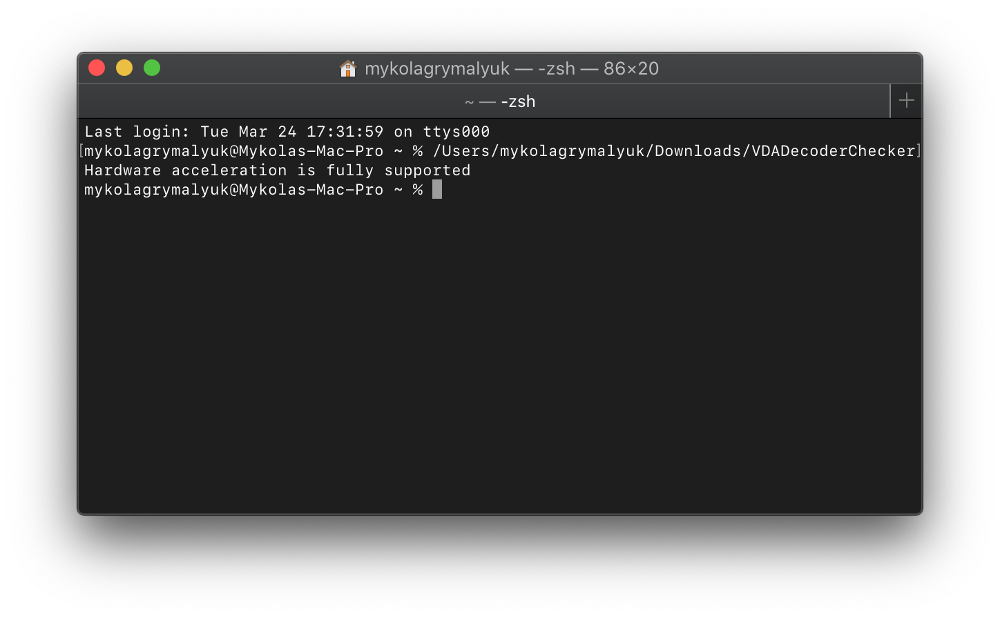
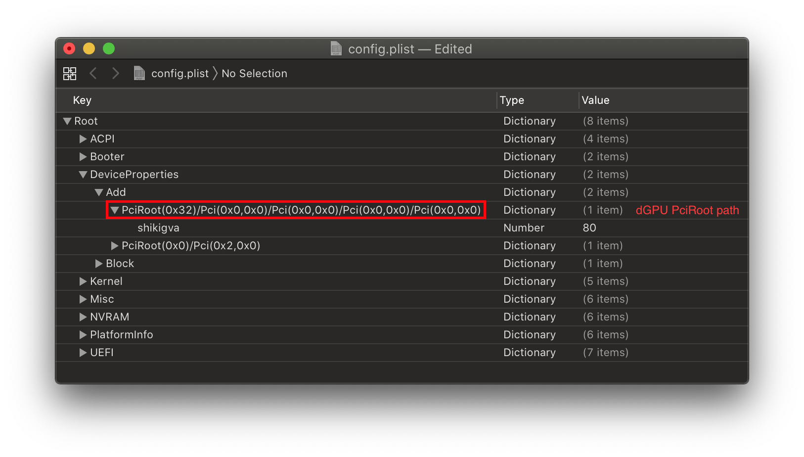

# Fixing DRM support and iGPU performance

* **Note**: Safari 14 and macOS 11, Big Sur are currently unsupported by WhateverGreen's DRM patches. Safari 13 in Catalina and older are supported just fine however.

So with DRM, we have a couple things we need to mention:

* DRM requires a supported dGPU
  * See the [GPU Buyers Guide](https://dortania.github.io/GPU-Buyers-Guide/) for supported cards
* DRM is broken for iGPU-only systems
  * This could be fixed with Shiki (now WhateverGreen) til 10.12.2, but broke with 10.12.3
  * This is due to the issue that our iGPUs don't support Apple's firmware and that our [Management Engine](https://en.wikipedia.org/wiki/Intel_Management_Engine) doesn't have Apple's certificate
* Working hardware acceleration and decoding

## Testing Hardware Acceleration and Decoding

So before we can get started with fixing DRM, we need to make sure your hardware is working. The best way to check is by running [VDADecoderChecker](https://i.applelife.ru/2019/05/451893_10.12_VDADecoderChecker.zip):



If you fail at this point, there's a couple things you can check for:

* Make sure your hardware is supported
  * See [GPU Buyers Guide](https://dortania.github.io/GPU-Buyers-Guide/)
* Make sure the SMBIOS you're running matches with your hardware
  * Don't use a Mac Mini SMBIOS on a desktop for example, as Mac Minis run mobile hardware and so macOS will expect the same
* Make sure the iGPU is enabled in the BIOS and has the correct properties for your setup (`AAPL,ig-platform-id` and if needed, `device-id`)
  * You can either review the DeviceProperties section from the guide or [WhateverGreen's manual](https://github.com/acidanthera/WhateverGreen/blob/master/Manual/FAQ.IntelHD.en.md)
* Avoid unnecessary ACPI renames, all important ones are handled in WhateverGreen
  * change GFX0 to IGPU
  * change PEG0 to GFX0
  * change HECI to IMEI
  * [etc](https://github.com/dortania/OpenCore-Install-Guide/blob/master/clover-conversion/Clover-config.md)
* Make sure Lilu and WhateverGreen are loaded
  * Make sure not to have any legacy graphics patches present as they've been absorbed into WhateverGreen:
    * IntelGraphicsFixup.kext
    * NvidiaGraphicsFixup.kext
    * Shiki.kext

To check if Lilu and WhateverGreen loaded correctly:

```
kextstat | grep -E "Lilu|WhateverGreen"
```

> Hey one or more of these kexts aren't showing up

Generally the best place to start is by looking through your OpenCore logs and seeing if Lilu and WhateverGreen injected correctly:

```
14:354 00:020 OC: Prelink injection Lilu.kext () - Success
14:367 00:012 OC: Prelink injection WhateverGreen.kext () - Success
```

If it says failed to inject:

```
15:448 00:007 OC: Prelink injection WhateverGreen.kext () - Invalid Parameter
```

Main places you can check as to why:

* **Injection order**: Make sure that Lilu is above WhateverGreen in kext order
* **All kexts are latest release**: Especially important for Lilu plugins, as mismatched kexts can cause issues

Note: To setup file logging, see [OpenCore Debugging](https://dortania.github.io/OpenCore-Install-Guide/troubleshooting/debug.html).

**Note**: On macOS 10.15 and newer, AppleGVA debugging is disabled by default, if you get a generic error while running VDADecoderChecker you can enable debugging with the following:

```
defaults write com.apple.AppleGVA enableSyslog -boolean true
```

And to undo this once done:

```
defaults delete com.apple.AppleGVA enableSyslog
```

## Testing DRM

So before we get too deep, we need to go over some things, mainly the types of DRM you'll see out in the wild:

**FairPlay 1.x**: Software based DRM, used for supporting legacy Macs more easily

* Easiest way to test this is by playing an iTunes movie: [FairPlay 1.x test](https://drive.google.com/file/d/12pQ5FFpdHdGOVV6jvbqEq2wmkpMKxsOF/view)
  * FairPlay 1.x trailers will work on any configuration if WhateverGreen is properly set up - including iGPU-only configurations. However, FairPlay 1.x *movies* will only play on iGPU-only configurations for around 3-5 seconds, erroring that HDCP is unsupported afterwards.

**FairPlay 2.x/3.x**: Hardware based DRM, found in Netflix, Amazon Prime

* There's a couple ways to test:
  * Play a show in Netflix or Amazon Prime
  * Play an Amazon Prime trailer: [Spider-Man: Far From Home](https://www.amazon.com/Spider-Man-Far-Home-Tom-Holland/dp/B07TP6D1DP)
    * Trailer itself does not use DRM but Amazon still checks before playing
* Note: Requires newer AMD GPU to work (Polaris+)

**FairPlay 4.x**: Mixed DRM, found on AppleTV+

* You can open TV.app, choose TV+ -> Free Apple TV+ Premieres, then click on any episode to test without any trial (you do need an iCloud account)
* Apple TV+ also has a free trial if you want to use it
* Note: Requires either an absent iGPU (Xeon) or newer AMD GPU to work (Polaris+)
  * Possible to force FairPlay 1.x when iGPU is absent

If everything works on these tests, you have no need to continue! Otherwise, proceed on.

## Fixing DRM

So for fixing DRM we can go down mainly 1 route: patching DRM to use either software or AMD decoding. Vit made a great little chart for different hardware configurations:

* [WhateverGreen's DRM chart](https://github.com/acidanthera/WhateverGreen/blob/master/Manual/FAQ.Chart.md)

So how do you use it? First, identify what configuration you have in the chart (AMD represents GPU, not CPU). The SMBIOS listed (IM = iMac, MM = Mac Mini, IMP = iMac Pro, MP = Mac Pro) is what you should use if you match the hardware configuration. If you don't match any of the configurations in the chart, you're out of luck.

Next, identify what Shiki mode you need to use. If there are two configurations for your setup, they will differ in the Shiki flags used. Generally, you want hardware decoding over software decoding. If the mode column is blank, then you are done. Otherwise, you should add `shikigva` as a property to any GPU, using DeviceProperties > Add. For example, if the mode we need to use is `shikigva=80`:



You can also use the boot argument - this is in the mode column.

Here's one example. If we have an Intel i9-9900K and an RX 560, the configuration would be "AMD+IGPU", and we should be using an iMac or Mac Mini SMBIOS (for this specific configuration, iMac19,1). Then we see there are two options for the configuration: one where the mode is `shikigva=16`, and one with `shikigva=80`. We see the difference is in "Prime Trailers" and "Prime/Netflix". We want Netflix to work, so we'll choose the `shikigva=80` option. Then inject `shikigva` with type number/integer and value `80` into our iGPU or dGPU, reboot, and DRM should work.

Here's another example. This time, We have an Ryzen 3700X and an RX 480. Our configuration in this case is just "AMD", and we should be using either an iMac Pro or Mac Pro SMBIOS. Again, there are two options: no shiki arguments, and `shikigva=128`. We prefer hardware decoding over software decoding, so we'll choose the `shikigva=128` option, and again inject `shikigva` into our dGPU, this time with value `128`. A reboot and DRM works.

**Notes:**

* You can use [gfxutil](https://github.com/acidanthera/gfxutil/releases) to find the path to your iGPU/dGPU.
  * `path/to/gfxutil -f GFX0`
  * `GFX0`: For dGPUs, if multiple installed check IORegistryExplorer for what your AMD card is called
  * `IGPU`: For iGPU
* If you inject `shikigva` using DeviceProperties, ensure you only do so to one GPU, otherwise WhateverGreen will use whatever it finds first and it is not guaranteed to be consistent.
* IQSV stands for Intel Quick Sync Video: this only works if iGPU is present and enabled and it is set up correctly.
* Special configurations (like Haswell + AMD dGPU with an iMac SMBIOS, but iGPU is disabled) are not covered in the chart. You must do research on this yourself.
* [Shiki source](https://github.com/acidanthera/WhateverGreen/blob/master/WhateverGreen/kern_shiki.hpp) is useful in understanding what flags do what and when they should be used, and may help with special configurations.
* For error `VDADecoderCreate failed. err: -12473` in Big Sur, forcing the AMD Decoder(on applicable systems) can help resolve this:

    ```sh
    defaults write com.apple.AppleGVA gvaForceAMDAVCDecode -boolean yes
    ```
