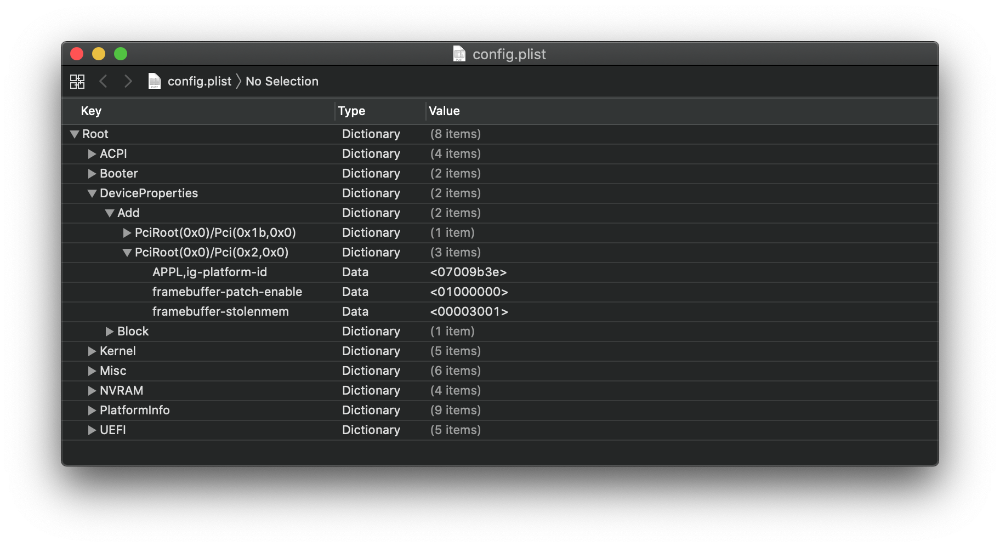
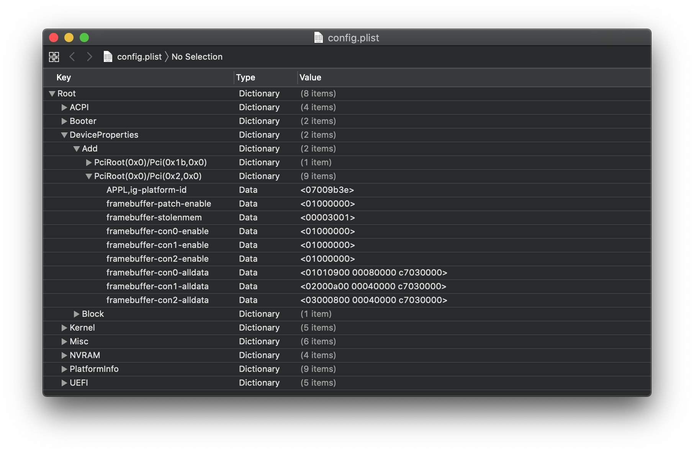

# GPU Patching

* Supported version: 0.5.9

This little section is for those who need more than what is provided by simple framebuffer patching and WhateverGreen's auto-patches:

* [Applying a fakeID for unsupported GPUs](https://dortania.github.io/Getting-Started-With-ACPI/Universal/spoof.html)
* [iGPU BusID patching for 300 series motherboards](#iGPU-BusID-Patching)

## Converting a clover fakeID to OpenCore

Guide moved here: [Renaming GPUs](https://dortania.github.io/Getting-Started-With-ACPI/Universal/spoof.html)

## iGPU BusID Patching

This section is for users running "true" 300 series motherboards( B360, B365, H310, H370, Z390) who are having issues setting up their iGPU as a display out.

So to get started I'll assume you've already done basic framebuffer patches in your config from the [Coffee Lake portion of the guide](https://dortania.github.io/OpenCore-Install-Guide/config.plist/coffee-lake.html), it should look something like this:



* **Note**: With macOS 10.15.5, there seems to be a lot of issues with black screen using `07009B3E`, if you get similar issues try swapping to `00009B3E`

Now that we're prepped, we can start looking into busID patching. Checking the dumps on [InsanelyMac](https://www.insanelymac.com/forum/topic/334899-intel-framebuffer-patching-using-whatevergreen/) shows us this for the `3E9B0007` ID(Desktop UHD 630):

```
ID: 3E9B0007, STOLEN: 57 MB, FBMEM: 0 bytes, VRAM: 1536 MB, Flags: 0x00801302
TOTAL STOLEN: 58 MB, TOTAL CURSOR: 1 MB (1572864 bytes), MAX STOLEN: 172 MB, MAX OVERALL: 173 MB (181940224 bytes)
GPU Name: Intel UHD Graphics 630
Model Name(s):
Camelia: Disabled
Mobile: 0, PipeCount: 3, PortCount: 3, FBMemoryCount: 3
[1] busId: 0x05, pipe: 9, type: 0x00000400, flags: 0x000003C7 - DP
[2] busId: 0x04, pipe: 10, type: 0x00000400, flags: 0x000003C7 - DP
[3] busId: 0x06, pipe: 8, type: 0x00000400, flags: 0x000003C7 - DP
01050900 00040000 C7030000
02040A00 00040000 C7030000
03060800 00040000 C7030000
```

Looking at all this can be quite overwhelming, but we'll break it down to be a bit simpler. For use we care about this:

```
[1] busId: 0x05, pipe: 9, type: 0x00000400, flags: 0x000003C7 - DP
[2] busId: 0x04, pipe: 10, type: 0x00000400, flags: 0x000003C7 - DP
[3] busId: 0x06, pipe: 8, type: 0x00000400, flags: 0x000003C7 - DP
01050900 00040000 C7030000
02040A00 00040000 C7030000
03060800 00040000 C7030000
```

These are your iGPUs ports by default, lets go through port 1 and see what each section is used for:

The first port:

```
01050900 00040000 C7030000
```

Port: 01

* **01**050900 00040000 C7030000

busId: 0x05

* 01**05**0900 00040000 C7030000

Pipe Number 9 (little endian):

* 0105**0900** 00040000 C7030000

Connector type: DisplayPort

* 01050900 **00040000** C7030000

Flags - We leave it as default:

* 01050900 00040000 **C7030000**

Things to note:

* You cannot use the same busId twice, having 2 in use will create conflicts
* Pipe number and flags don't need to changed

List of connector types:

* `00 04 00 00` - DisplayPort
* `00 08 00 00` - HDMI
* `04 00 00 00` - Digital DVI
* `02 00 00 00` - LVDS (for laptops)
* `01 00 00 00` - Dummy port

### Mapping video ports

1. Plug display into HDMI port

2. Set Port 1 to the HDMI connector type:

   * 01xx0900 **00080000** C7030000

3. Disable ports 2 and 3 with busid=00:

   * 02**00**0A00 00040000 C7030000
   * 03**00**0800 00040000 C7030000

4. Walk through busids for Port 1 if the previous didn't work(yup you gotta do a shit ton of reboots). The maximum busid on most platforms is 0x06

   * 01**01**0900 00080000 C7030000
   * 01**02**0900 00080000 C7030000
   * 01**03**0900 00080000 C7030000
   * etc

If you still get no output, set port 1's busid to 00 and start going through busids for port 2 and so on

* 01000900 00040000 C7030000
* 02xx0A00 00080000 C7030000
* 03000800 00040000 C7030000

### Adding to your config.plist

So adding these patches are simple though a bunch of entries are required:

* framebuffer-con0-enable = `01000000`
* framebuffer-con1-enable = `01000000`
* framebuffer-con2-enable = `01000000`
* framebuffer-con0-alldata = port 1
* framebuffer-con1-alldata = port 2
* framebuffer-con2-alldata = port 3

So when adding the patches, port 1 will actually become con0 as the ports start at 0. These are also all data types when entering your values.

A finished config should look something like this:



Source for iGPU BusID patching: [CorpNewt's Brain](https://github.com/corpnewt)
