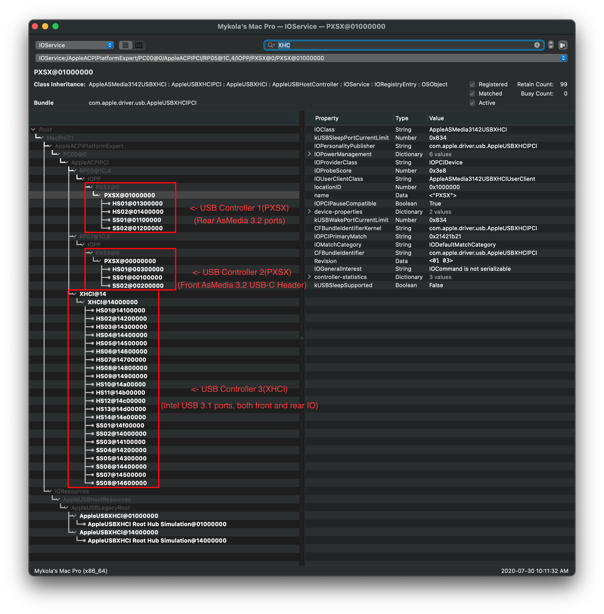
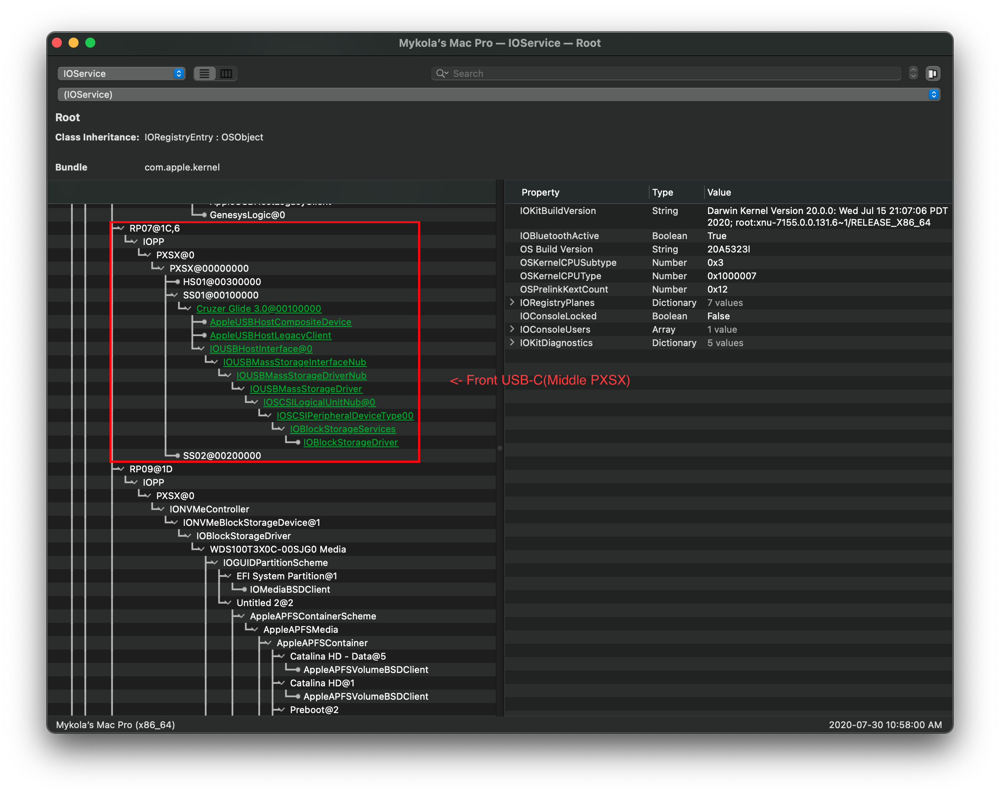
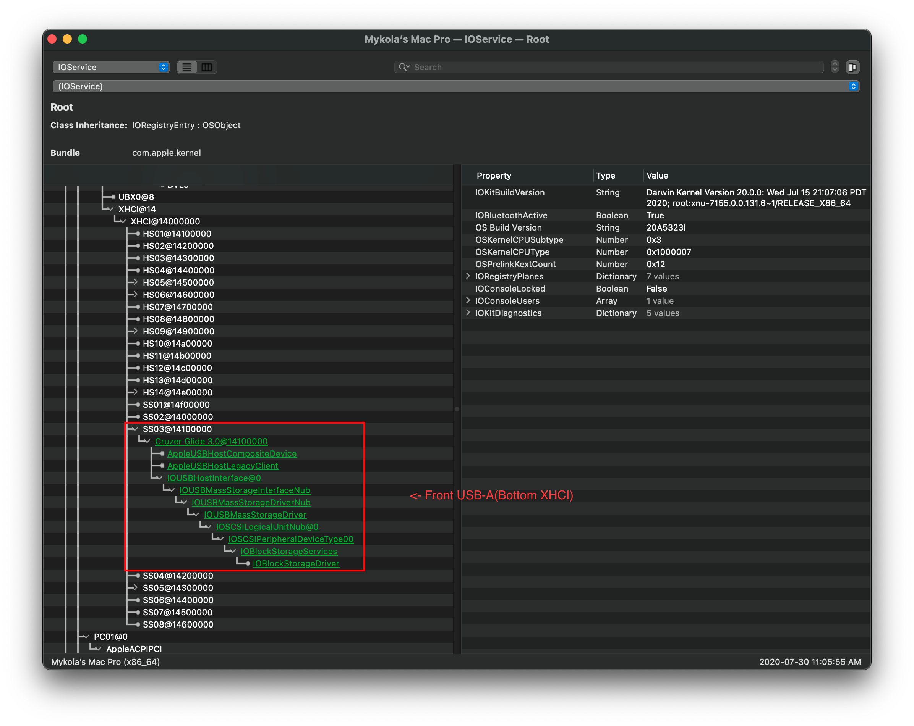
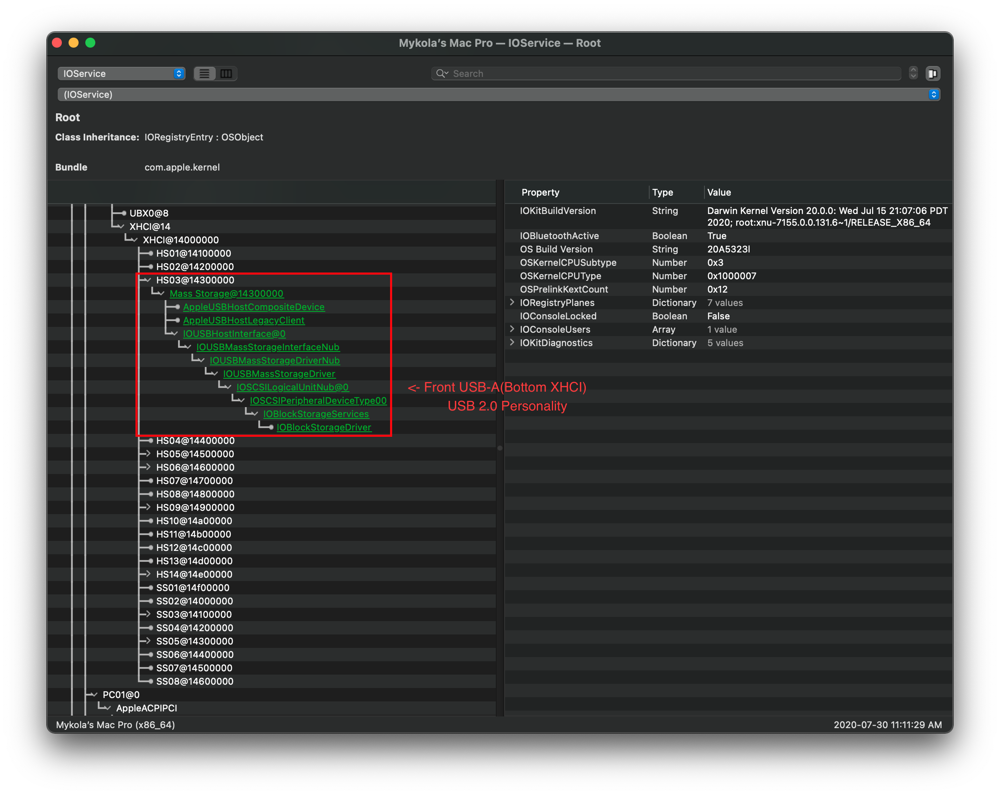
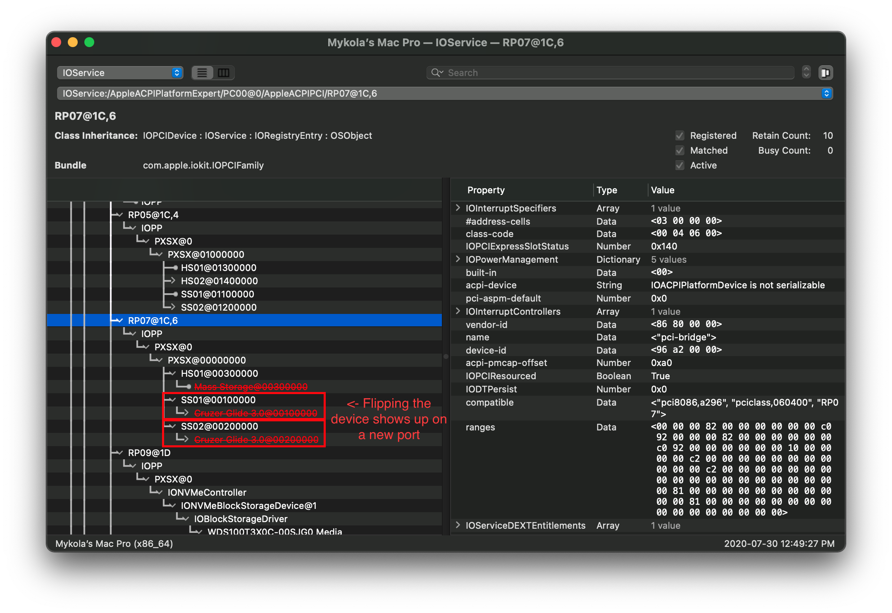
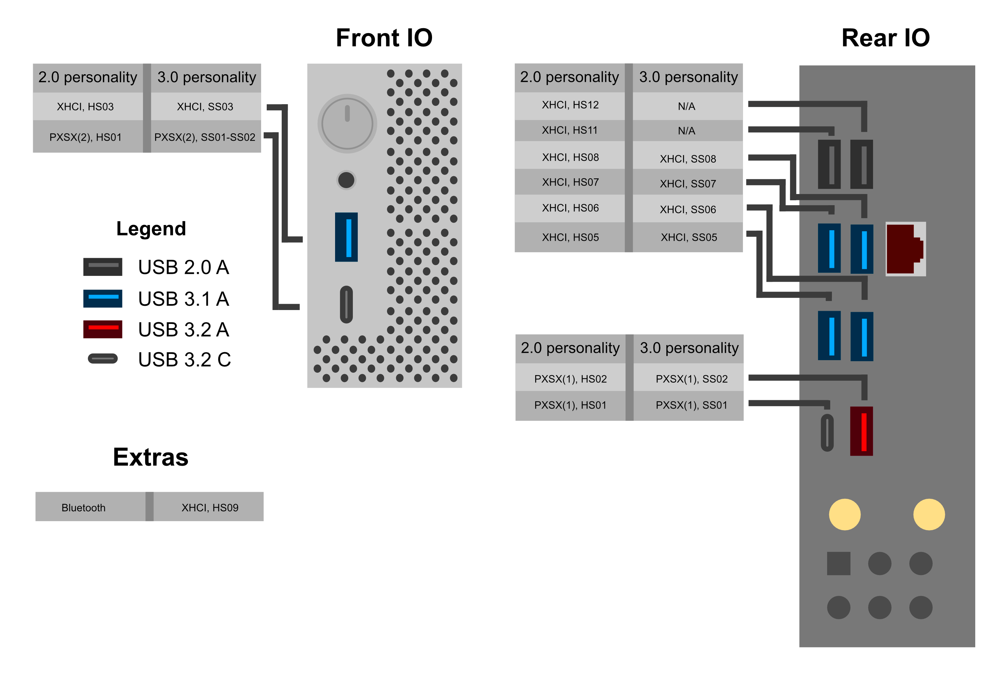
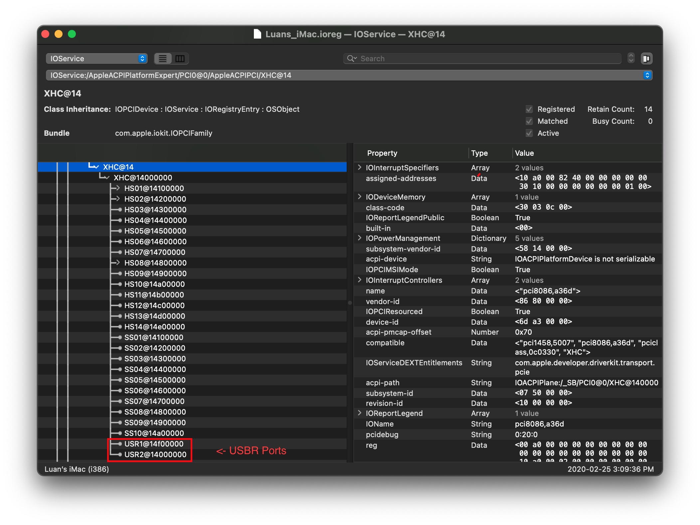
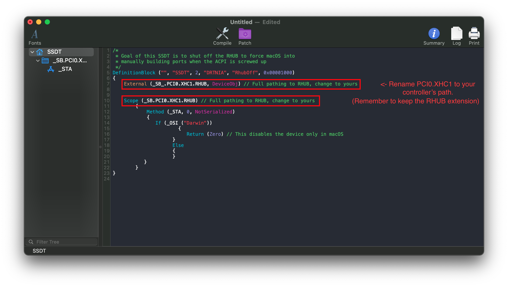
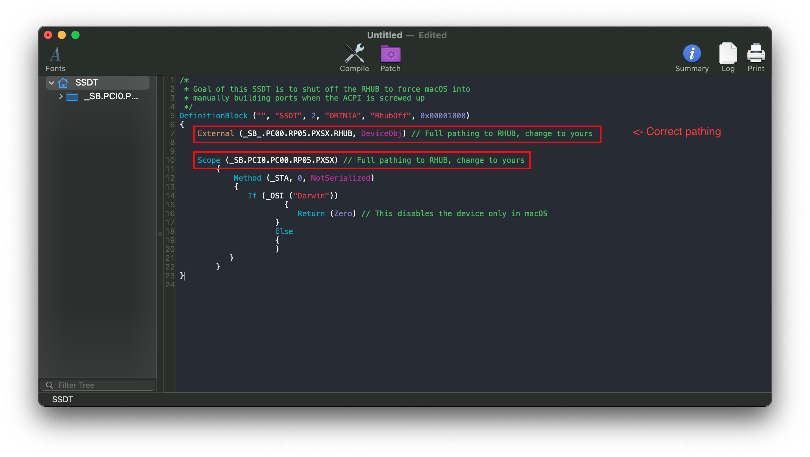
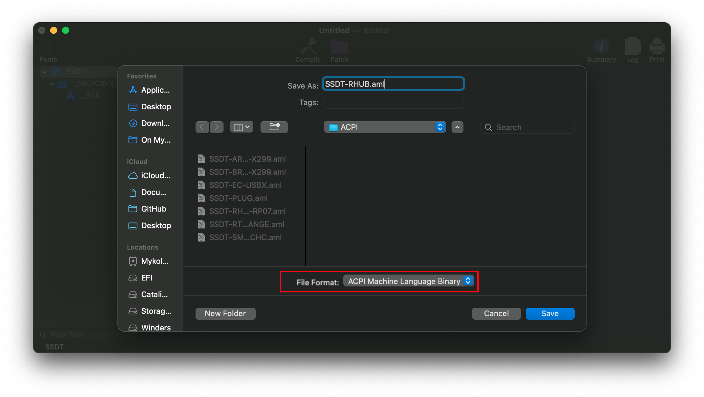

# USB Mapping

So with the prerequisites out of the way, we can finally get to the meat of this guide. And now we get to finally read one of my favorite books before I go to bed each night: [The Advanced Configuration and Power Interface (ACPI) Specification!](https://uefi.org/sites/default/files/resources/ACPI_6_3_final_Jan30.pdf)

Now if you haven't read through this before(which I highly recommend you do, it's a thrilling tale), I'll point you to the meat of the USB situation:

* Section 9.14: _UPC (USB Port Capabilities)

Here we're greeted with all the possible USB ports in ACPI:

| Type | Info | Comments |
| :--- | :--- | :--- |
| 0 | USB 2.0 Type-A connector | This is what macOS will default all ports to when no map is present |
| 3 | USB 3.0 Type-A connector | 3.0, 3.1 and 3.2 ports share the same Type |
| 8 | Type C connector - USB 2.0-only | Mainly seen in phones
| 9 | Type C connector - USB 2.0 and USB 3.0 with Switch | Flipping the device **does not** change the ACPI port |
| 10 | Type C connector - USB 2.0 and USB 3.0 without Switch | Flipping the device **does** change the ACPI port. generally seen on 3.1/2 motherboard headers |
| 255 | Proprietary connector | For Internal USB ports like Bluetooth |

## USB Mapping: The manual way

This section is for those who want to get down into the meats of their hackintosh, to really understand what it's doing and help if there's any issues with USBmap.py and other mapping tools. To start, we'll need a few things:

* Installed version of macOS
  * This is due to how macOS enumerates ports, trying to map from other OSes makes this difficult
  * Note: This guide will be focusing on OS X 10.11, El Capitan and newer. Older OSes shouldn't require any USB mapping
* Non-conflicting USB names
  * See previous section: [Checking what renames you need](../system-preparation.md#checking-what-renames-you-need)
* A USB 2.0 and USB 3.0 device to test with
  * You must have 2 separate devices as to ensure no mix ups with personalities
* [IORegistryExplorer.app](https://github.com/khronokernel/IORegistryClone/blob/master/ioreg-302.zip)
  * To view the inner workings of macOS more easily
  * If you plan to use Discord for troubleshooting, [v2.1.0](https://github.com/khronokernel/IORegistryClone/blob/master/ioreg-210.zip) is a bit easier on file size.
* [USBInjectAll](https://bitbucket.org/RehabMan/os-x-usb-inject-all/downloads/)
  * This is only required for older USB controllers like Broadwell and older, however some Coffee Lake systems may still require it
  * **Reminder** this kext does not work on AMD
* [Sample-USB-Map.kext](https://github.com/dortania/OpenCore-Post-Install/blob/master/extra-files/Sample-USB-Map.kext.zip)
* [ProperTree](https://github.com/corpnewt/ProperTree)
  * Or any other plist editor
  
Now with all this out of the way, lets get to USB mapping!

## Finding your USB ports

Lets open our previously downloaded [IORegistryExplorer.app](https://github.com/khronokernel/IORegistryClone/blob/master/ioreg-302.zip) and search for our USB controller(s).

The 2 main search terms are `XHC` and `EHC`, but if you have a legacy board with UHCI or OHCI controllers you'll need to adjust. A blanket `USB` search may show too many entries and confuse you.

For this example, lets try and map an Asus X299-E Strix board:



From the above image we can see 3 USB controllers:

* PXSX(1, Top)
* PXSX(2, Middle)
* XHCI(3, Bottom)

Pay attention that they're individual controllers, as this means **each USB controller has it's own port limit**. So you're not as starved for USB ports as you may think.

Now I personally know which USB controllers match up with which physical ports, problem is it's not always as obvious which ports match with which controllers. So lets try to figure out which is what.

**Note**: The AppleUSBLegacyRoot entry is an entry that lists all active USB controllers and ports, these are not USB controllers themselves so you can outright ignore them.

**Note 2**: Keep in mind every motherboard model will have a unique set of port combos, controller types and names. So while our example uses PXSX, yours might have the XHC0 or PTCP name. And quite common on older motherboards is that you may only have 1 controller, this is alright so don't stress about having the exact same setup as the example.

Common names you can check:

* USB 3.x controllers:
  * XHC
  * XHC0
  * XHC1
  * XHC2
  * XHCI
  * XHCX
  * AS43
  * PTXH
    * Commonly associated with AMD Chipset controllers
  * PTCP
    * Found on AsRock X399
  * PXSX
    * This is a generic PCIe device, **double check it's a USB device** as NVMe controllers and other devices can use the same name.
* USB 2.x controllers:
  * EHCI
  * EHC1
  * EHC2
  * EUSB
  * USBE

### Finding which ports match with which controller

To start, I'm going to plug a USB device into my front USB 3.1(Type-A) and 3.2(Type-C):


Next lets look at IOReg, and we can see where our USB devices fell:

| USB-C | USB-A |
| :--- | :--- |
|  |  |

Here we see a few things:

* Front 3.2 Type-C is on the PXSX(2, middle) Controller
* Front 3.1 Type-A is on the XHCI(3, Bottom) Controller

Now that we have an idea of which ports go to which controller, can can now look into how we USB map.

### USB-A mapping

As mentioned before, USB 3.x ports are split into 2 personalities: USB 2.0 and USB 3.0. This is to ensure backwards compatibility but macOS itself has difficulties determining which personalities match up to which ports. That's where we come in to help.

So lets take our USB-A port, when we plug in a USB 3.0 device into it we see `XHCI -> SS03` light up. This is the USB 3.0 personality of the port. Now we'll want to plug a USB 2.0 device into that port:

| 3.0 Personality | 2.0 Personality |
| :--- | :--- |
|  |  |

We see that the USB 2.0 personality of our 3.0 port is `XHCI -> HS03`, now you should be able to get an idea of what we're trying to do:

* Front Type-A:
  * HS03: 2.0 Personality
  * SS03: 3.0 Personality

**Note**: If your USB ports show up as either AppleUSB20XHCIPort or AppleUSB30XHCIPort, you can still map however it will be a bit more difficult. Instead of writing down the names, pay very close attention to the `port` property on the right hand side:


### Creating a personal map

This is where we pull out pen and paper, and start to write down which ports physically match up with which digital ports. An example of what your map can look like:

| Name Mapping | Property Mapping |
| :--- | :--- |
|  |  |

Your own map doesn't need to look exactly like this, however you'll want something that you can easily understand and refer to down the line.

Note:

* Name Mapping: When a proper name shows up in IOReg(ie. HS01)
* Property Mapping: When no proper name is given(ie. AppleUSB30XHCIPort)

### USB-C mapping

Next lets map our USB-C port, this is where it gets quite tricky as you may have noticed earlier:

| Type | Info | Comments |
| :--- | :--- | :--- |
| 8 | Type C connector - USB 2.0-only | Mainly seen in phones |
| 9 | Type C connector - USB 2.0 and USB 3.0 with Switch | Flipping the device **does not** change the ACPI port |
| 10 | Type C connector - USB 2.0 and USB 3.0 without Switch | Flipping the device **does** change the ACPI port. generally seen on 3.1/2 motherboard headers |

So when we map our USB-C header, we notice it occupies the SS01 port. But when we flip it, we actually populate it on the SS02 port. When this happens, you'll want to write this down for when we apply the port type.

* Note: All personalities from this port will be put under the Type 10
* Note 2: Not all USB-C headers will be Type 10, **double check yours**



### Continuing mapping

Now that you have the basic idea, you'll want to go around with every USB port and map it out. This will take time, and don't forget to write it down. Your final diagram should look similar to this:



### Special Notes

* [Bluetooth](#bluetooth)
* [USRx Ports](#usrx-ports)
* [Missing USB Ports](#missing-usb-ports)

#### Bluetooth

So while not obvious to many, Bluetooth actually runs over the USB interface internally. This means that when mapping, you'll need to pay close attention to devices that already show up in IOReg:


Keep this in mind, as this plays into the Type 255 and getting certain services like handoff working correctly.

#### USRx Ports

When mapping, you may notice some extra ports left over, specifically USR1 and USR2. These ports are known as "USBR" ports, or more specifically [USB Redirection Ports](https://software.Intel.com/content/www/us/en/develop/documentation/amt-developer-guide/top/storage-redirection.html). Use of these is for remote management but real Macs don't ship with USBR devices and so has no support for them OS-wise. You can actually ignore these entries in your USB map:



#### Missing USB ports

In some rare situations, certain USB ports may not show up in macOS at all. This is likely due to a missing definition in your ACPI tables, and so we have a few options:

* Coffee Lake and older should use [USBInjectAll](https://github.com/Sniki/OS-X-USB-Inject-All/releases)
  * Don't forget to add this to both EFI/OC/Kexts and you config.plist's kernel -> Add
* Comet Lake and newer should use SSDT-RHUB
* AMD systems should also use SSDT-RHUB

SSDT-RHUB's purpose is to reset your USB controller, and force macOS to reenumerate them. This avoids the hassle of trying to patch your existing ACPI tables.

To create your own SSDT-RHUB-MAP:

* Grab a copy of the SSDT: [SSDT-RHUB.dsl](https://github.com/dortania/Getting-Started-With-ACPI/blob/master/extra-files/decompiled/SSDT-RHUB.dsl)
* Grab [maciASL](https://github.com/acidanthera/MaciASL/releases/tag/1.5.7)

Next, open our newly downloaded SSDT with maciASL, you should be presented with the following:


Now, open IOReg and find the USB controller you want to reset(pay very close attention its the USB controller and not the child RHUB with the same name):

If you look to the right side, you should see the `acpi-apth` property. Here we're going to need to translate it to something our SSDT can use:

```sh
# before modifying
IOService:/AppleACPIPlatformExpert/PC00@0/AppleACPIPCI/RP05@1C,4/IOPP/PXSX@0
```

Now we'll want to strip out any unnecessary data:

* `IOService:/AppleACPIPlatformExpert/`
* `@##`
* `IOPP`

Once cleaned up, yours should look similar:

```sh
# After modifying
PC00.RP05.PXSX
```

Following the example from above, we'll be renaming `PCI0.XHC1.RHUB` to `PC00.RP05.PXSX.RHUB`:

**Before**:

```
External (_SB_.PCI0.XHC1.RHUB, DeviceObj) <- Rename this

Scope (_SB.PCI0.XHC1.RHUB) <- Rename this
```



Following the example pathing we found, the SSDT should look something like this:

**After**:

```
External (_SB.PC00.RP05.PXSX.RHUB, DeviceObj) <- Renamed

Scope (_SB.PC00.RP05.PXSX.RHUB) <- Renamed
```



Once you've edited the SSDT to your USB controller's path, you can export it with `File -> SaveAs -> ACPI Machine Language Binary`:



Finally, remember to add this SSDT to both EFI/OC/ACPI and your config.plist under ACPI -> Add.
