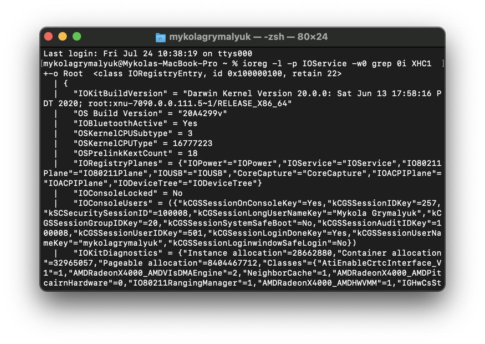
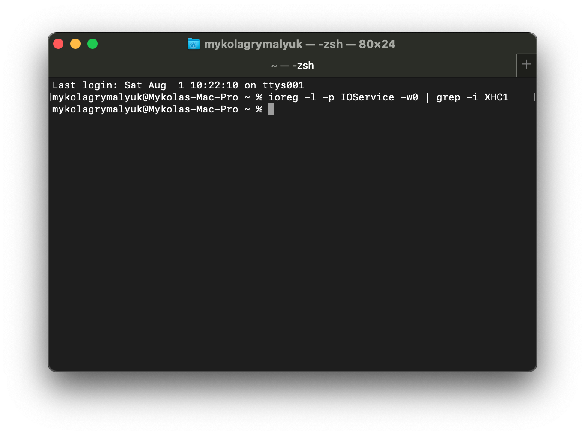

# System Preparation

Table of Contents:

* [System Preparation](#system-preparation)
* [Checking what renames you need](#checking-what-renames-you-need)
* [Parting ways](#parting-ways)

So before we can USB map, we need to set a couple things:

* [USBInjectAll](https://github.com/Sniki/OS-X-USB-Inject-All/releases) under both EFI/OC/Kexts and config.plist -> Kernel -> Add
  * We need this kext to make sure any ports not defined in ACPI will still show up in macOS, note that this *shouldn't* be required on Skylake and newer as the USB ports are defined within ACPI.
    * Because OEMs don't always include the ports even on newer systems, we recommend all Intel users use USBInjectAll until properly mapped.
  * Note that this **does not work on AMD**
* config.plist -> Kernel -> Quirks -> XhciPortLimit -> True
  * So we can temporally get around the 15 port limit to map our ports
* config.plist -> ACPI -> Patch -> EHCI and XHCI ACPI renames

The reason we need these ACPI renames are due to conflicting with Apple's own USB map, fun fact even Apple has to USB map as well! You can actually find Apple's USB map within IOUSBHostFamily.kext -> PlugIns -> AppleUSBHostPlatformProperties.kext in Catalina, though newer Macs actually port map with their ACPI tables instead.

SMBIOSes that **do not** need the ACPI renames:

* iMac18,x and newer
* MacPro7,1 and newer
* Macmini8,1 and newer
* MacBook9,x  and newer
* MacBookAir8,x  and newer
* MacBookPro13,x and newer

And so with older SMBIOSes(one's not listed above), we need to make sure their port map does not attach while we're trying to USB map ourselves. Else some ports may disappear, and please check you do have these ports in your ACPI tables **before** applying these patches as we don't want to patch the wrong devices. If you do find your USB controller needs renaming, write down their original names before the rename as this will make USB mapping down the road a bit easier:

* **XHC1 to SHCI**: Needed for Skylake and older SMBIOS

| Key | Type | Value |
| :--- | :--- | :--- |
| Comment | String | XHC1 to SHCI |
| Count | Number | <0> |
| Enabled | Boolean | YES |
| Find | Data | <58484331> |
| Limit | Number | <0> |
| Replace | Data | <53484349> |
| Skip | Number | <0> |
| Tablelength | Number | <0> |
| TableSignature | Data | <> |

* **EHC1 to EH01**: Needed for Broadwell and older SMBIOS

| Key | Type | Value |
| :--- | :--- | :--- |
| Comment | String | EHC1 to EH01 |
| Count | Number | <0> |
| Enabled | Boolean | YES |
| Find | Data | <45484331> |
| Limit | Number | <0> |
| Replace | Data | <45483031> |
| Skip | Number | <0> |
| Tablelength | Number | <0> |
| TableSignature | Data | <> |

* **EHC2 to EH02**: Needed for Broadwell and older SMBIOS

| Key | Type | Value |
| :--- | :--- | :--- |
| Comment | String | EHC2 to EH02 |
| Count | Number | <0> |
| Enabled | Boolean | YES |
| Find | Data | <45484332> |
| Limit | Number | <0> |
| Replace | Data | <45483032> |
| Skip | Number | <0> |
| Tablelength | Number | <0> |
| TableSignature | Data | <> |

## Checking what renames you need

So with renames it's pretty easy to find out, first figure out what SMBIOS you're using(can be found in your config.plist under `PlatformInfo -> Generic -> SystemProductName`) and match figure out whether you even need a USB map:

SMBIOS needing only XHC1 rename:

* iMacPro1,1
* iMac17,x and older
* MacBookAir7,x

SMBIOS needing XHC1 and EHC1 rename:

* MacPro6,1
* Macmini7,1
* MacBook8,x
* MacBookAir6,x
* MacBookPro12,x

SMBIOS needing XHC1, EHC1 and EHC2 renames:

* iMac16,x and older
* MacPro5,1 and older
* Macmini6,x and older
* MacBookAir5,x  and older
* MacBookPro11,x and older

Now that we know what renames our SMBIOS need, we can next check the names of our USB controllers. 

### Checking IOService

Let's take XHC1 and execute the following command:

```sh
ioreg -l -p IOService -w0 | grep -i XHC1
```
If you see this, you need a rename: |  If you see this, you do not need a rename:
:-------------------------:|:-------------------------:
  |  

Repeat this step for all the other relevant conflicting devices (e.g. EHC1, EHC2) as listed in the table above for your model.

```sh
ioreg -l -p IOService -w0 | grep -i EHC1
ioreg -l -p IOService -w0 | grep -i EHC2
```

And with that, we now add our needed ACPI renames to our config.plist -> ACPI -> Patch, you can find a pre-made file here(note that you'll need to enable the ones you need):

* **[usb-rename.plist](https://github.com/dortania/OpenCore-Post-Install/blob/master/extra-files/usb-rename.plist)**

# Parting ways

But now we must part into 2 sections, depending on which hardware you have:

* [Intel USB Mapping](../usb/intel-mapping/intel.md)
  * A more automated process, Intel only however
* [Manual USB Mapping](../usb/manual/manual.md)
  * More step by step process, and is the only way to map AMD and 3rd party USB controllers properly.
